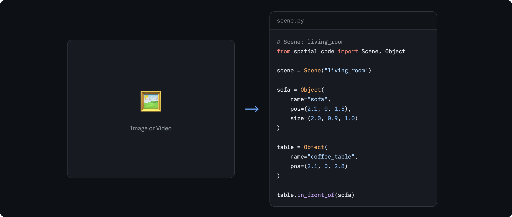

<p align="center">
  <picture>
    <source media="(prefers-color-scheme: dark)" srcset="docs/teaser1a.png">
    
  </picture>
</p>

> **Thinking with Spatial Code for Physical-World Video Reasoning**
>
> Jieneng Chen\*, Wenxin Ma\*, Ruisheng Yuan\*, Yunzhi Zhang\*, Jiajun Wu†, Alan Yuille†
> Johns Hopkins University & Stanford University
>
> [Paper](https://arxiv.org/pdf/2603.05591)

**Spatial Code** — Transform visual scenes into structured, executable 3D representations for spatial reasoning.

<p align="center">
  <picture>
    <source media="(prefers-color-scheme: dark)" srcset="docs/teaser2a.png">
    
  </picture>
</p>

## 🗓️ Release Timeline

Stay tuned!

- [x] arXiv paper — released on **March 5** → [arXiv:2603.05591](https://arxiv.org/pdf/2603.05591)
- [ ] Codebase — releasing by **March 17**
- [ ] Reinforcement training details — releasing by **March 22**
- [ ] Reproducible models — releasing by **March 31**

## 📖 Citation

If you find this work useful, please consider citing:

```bibtex
@article{chen2025spatialcode,
  title={Thinking with Spatial Code for Physical-World Video Reasoning},
  author={Chen, Jieneng and Ma, Wenxin and Yuan, Ruisheng and Zhang, Yunzhi and Wu, Jiajun and Yuille, Alan},
  journal={arXiv preprint arXiv:2603.05591},
  year={2025}
}
```
